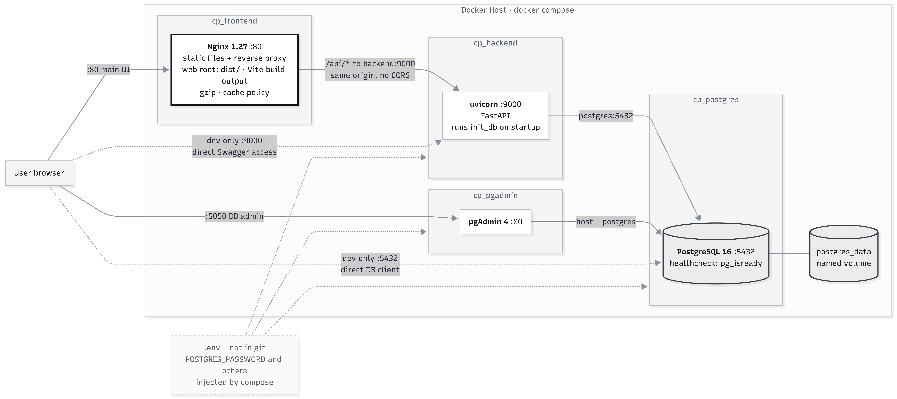

# 3D Container Packing System

*[中文版本](README(zh).md)*

> 3D bin-packing with forklift aisle constraints, real-time visualization, and full-stack Docker deployment.

**Live Demo → [wutesta0101-hue.github.io/container-packing](https://wutesta0101-hue.github.io/container-packing)**


---

## What It Does

Upload cargo data — manual entry or CSV — and the system computes an optimal 3D loading plan for a shipping container, enforcing the physical constraints that determine whether a plan is actually executable on the floor:

- **Forklift aisle clearance** — every item must be reachable by a forklift entering from the door. Enforced geometrically, not as a heuristic.
- **Stacking rules** — items stack only on stackable cargo, and only when the upper item's density is at most 105% of its support.
- **Support coverage** — at least 90% of an item's base must rest on something, computed as an exact area union rather than a corner check.
- **VIP priority** — designated high-value cargo is packed into the innermost positions first.
- **Inside-out loading order** — packing proceeds from the rear of the container toward the door, matching real forklift workflow.

Results render in interactive 3D with X-ray mode, step-by-step playback, and a utilization / centre-of-gravity dashboard.

| Solid view | X-ray view |
|---|---|
|  |  |

The playback bar replays the loading sequence one item at a time, so a warehouse team can see the intended order rather than just the final state.

---

## System Architecture


The frontend is a three-panel React app sharing a single Zustand store. All packing logic lives in `algorithm/packing.py` — pure functions with no framework dependencies, unit-testable in isolation. The four physical constraints are evaluated in sequence on every candidate position.

---

## Deployment Topology



Four containers behind a single published port. Nginx serves the built frontend and reverse-proxies `/api/*` to the backend, so the browser sees one origin and no CORS configuration is required in production.

Only `:80` and `:8080` are exposed. Direct access to the API (`:9000`) and the database (`:5432`) exists solely through `docker-compose.override.yml`, a development-only file — a client deployment has neither.

Application data lives in the `postgres_data` named volume, outside every container. This is why `docker compose down` preserves data while `down -v` destroys it.

---

## Core Algorithm

The packing engine implements a 3D **Bottom-Left-Back (BLB) anchor-point** algorithm. Each item is placed at the first feasible anchor that passes four sequential physical constraints.

### Coordinate system

Origin $(0,0,0)$ is the rear-left-bottom corner. The door is at $x = L_{container}$.

```
z (height)
│
│    y (width)
│   ╱
│  ╱
│ ╱
└──────── x (depth, toward door)
```

### 1. Sorting strategy

Items are sorted by a three-key priority before packing begins:

$$\text{key}(i) = \big(\lnot\,\mathrm{VIP}_i,\; -V_i,\; -m_i\big), \qquad V_i = L_i W_i H_i$$

VIP items always land deepest, matching real inside-out loading order.

### 2. Anchor-point generation

After placing item $k$ at $(x_k, y_k, z_k)$, three new candidate anchors appear:

$$A_{k+1} = \{(x_k + L_k,\, y_k,\, z_k),\ (x_k,\, y_k + W_k,\, z_k),\ (x_k,\, y_k,\, z_k + H_k)\}$$

Anchors are tried in lexicographic order $(x, z, y)$ — deepest first, then lowest, then leftmost — which produces dense, floor-hugging arrangements.

### 3. Constraint stack

Every candidate position must pass four checks, in order:

**① Boundary**

$$x + L_i \le L_c \ \land\ y + W_i \le W_c \ \land\ z + H_i \le H_c$$

**② Collision (AABB)**

For every placed item $p$, no axis-aligned bounding box overlap:

$$x + L_i \le p.x \ \lor\ p.x + p.L \le x \ \lor\ y + W_i \le p.y \ \lor\ \cdots$$

**③ Stacking support**

If $z > 0$, the item must rest on stackable supports satisfying both a density rule and a coverage rule:

$$\rho_{upper} \le \rho_{support} \times 1.05$$

$$\frac{\text{Area}\!\left(\bigcup_s \text{proj}(s) \cap \text{base}(i)\right)}{L_i \times W_i} \ \ge\ 0.9$$

The union area is computed exactly by a sweep-line algorithm in $O(N^2)$ — a corner-sampling approximation would accept overhangs that collapse in practice.

**④ Forklift aisle clearance**

The corridor between the candidate position and the door must be clear within the forklift's operating envelope. A fork-reach tolerance $r = 0.9 \times l_{fork}$ allows the forks to slide partially under the next item:

$$\forall\, p \in \text{placed}: \quad p.x \ge x + L_i + r \implies \lnot\big(Y_{overlap}(p) \land p.z < H_{forklift}\big)$$

where $Y_{overlap}$ tests whether $p$ falls within the aisle width $\max(W_i, W_{forklift})$ centred on the item's $y$ midpoint.

---

## Tech Stack

| Layer | Technology |
|---|---|
| Frontend | React 18 + Vite, Three.js, Zustand, Axios |
| 3D rendering | Three.js r128 (custom OrbitControls) |
| Backend | Python 3.11, FastAPI, Pydantic v2 |
| Database | PostgreSQL 16, SQLAlchemy ORM |
| Containerization | Docker + Docker Compose |
| Frontend serving | Nginx (production build) |

---

## Quick Start

**Prerequisites** — Docker Desktop (or Docker Engine + Compose plugin), Git.

```bash
git clone https://github.com/wutesta0101-hue/container-packing.git
cd container-packing

cp .env.docker.example .env
# defaults work out of the box; edit only to change DB credentials

docker compose up -d
```

> The target filename must be `.env`. Docker Compose only auto-loads `.env`; any other name requires `--env-file`, and omitting the flag makes Compose fall back to built-in defaults silently rather than raising an error.

This starts four services:

| Service | URL | Purpose |
|---|---|---|
| Frontend | `http://localhost` | React app via Nginx |
| Backend | internal | FastAPI (port 9000) |
| PostgreSQL | internal | Database |
| pgAdmin | `http://localhost:8080` | DB management UI |

When registering the server in pgAdmin, set **Host** to `postgres`, not `localhost` — pgAdmin runs inside a container where `localhost` refers to itself, and Docker's internal DNS resolves service names as hostnames.

Verify:

```bash
docker compose ps            # all services "running"
docker compose logs backend  # should show "Uvicorn running"
```

Open `http://localhost` — the packing interface loads. Click **Load sample data** to try it without entering cargo manually.

Stop:

```bash
docker compose down          # stop, data preserved
docker compose down -v       # stop and wipe database
```

---

## API Reference

### `POST /api/v1/pack`

Submit cargo data and run the packing algorithm.

```json
{
  "container_type": "40",
  "forklift_type": "E35SH",
  "cargo": [
    {
      "id": "A001",
      "type": "heavy",
      "L": 1200,
      "W": 1000,
      "H": 800,
      "weight": 800,
      "quantity": 4,
      "stackable": true,
      "rotatable": true
    }
  ]
}
```

```json
{
  "task_id": "task_a3f9c2e81b04",
  "packed": [
    {
      "id": "A001-1",
      "base_id": "A001",
      "type": "heavy",
      "L": 1200, "W": 1000, "H": 800,
      "weight": 800.0,
      "stackable": true,
      "x": 0, "y": 0, "z": 0,
      "is_packed": true,
      "rotated": false
    }
  ],
  "unpacked": [],
  "utilization": 8.51
}
```

`utilization` is a percentage in the range 0–100. Items in `unpacked` carry `is_packed: false` and `null` coordinates. A batch with `quantity: 4` expands into four individual units — `A001-1` through `A001-4` — with `base_id` preserving the original batch identifier.

Validation errors return **422** with a structured `detail` array naming the offending field. An empty cargo list, an unknown container or forklift code, a non-positive dimension, or whitespace inside an ID are all rejected before the handler runs.

### `GET /api/v1/results/{task_id}`

Retrieve a previously computed result. Returns the same payload plus `created_at`, `container_type`, and `forklift_type`. Unknown IDs return 404.

---

## Reference Data

### Containers

| Code | Dimensions L × W × H (mm) | Max payload (kg) |
|---|---|---|
| `20` | 5,898 × 2,352 × 2,393 | 28,000 |
| `40` | 12,032 × 2,352 × 2,393 | 26,000 |
| `40HQ` | 12,032 × 2,352 × 2,698 | 26,000 |

### Forklifts

Based on Linde E-series technical specifications. The selected model determines the required aisle width, so it directly changes the result.

| Code | Model | Body width (mm) | Body height (mm) | Capacity (kg) |
|---|---|---|---|---|
| `E25` | Linde E25 | 1,175 | 2,200 | 2,500 |
| `E25S` | Linde E25 S | 1,175 | 2,200 | 2,500 |
| `E25SH` | Linde E25 SH | 1,228 | 2,200 | 2,500 |
| `E30S` | Linde E30 S | 1,228 | 2,200 | 3,000 |
| `E30SH` | Linde E30 SH | 1,228 | 2,200 | 3,000 |
| `E35SH` | Linde E35 SH | 1,325 | 2,200 | 3,500 |

Fork length is 1,150 mm across all models, with a 0.9 reach factor applied in the clearance check.

### Cargo types

| Code | Label | Behaviour |
|---|---|---|
| `normal` | Standard | Default |
| `heavy` | Heavy | Distinct colour; density rules apply as for any item |
| `fragile` | Fragile | Typically declared `stackable: false` |
| `vip` | VIP | Sorted first, placed innermost |

### CSV import format

Save as UTF-8 — Excel's default CSV export may use a regional encoding and garble non-ASCII text.

```csv
id,type,length,width,height,weight,quantity,stackable,rotatable
A001,heavy,1200,1000,800,800,4,true,true
B001,fragile,1000,800,600,150,5,false,true
V001,vip,1400,1100,1000,600,2,true,true
```

| Column | Type | Description |
|---|---|---|
| `id` | string | Batch identifier; must not contain whitespace |
| `type` | enum | `normal` / `heavy` / `fragile` / `vip` |
| `length`, `width`, `height` | integer (mm) | Dimensions |
| `weight` | float (kg) | Per unit; drives the stacking density check |
| `quantity` | integer | Number of identical units in the batch |
| `stackable` | boolean | Whether other items may rest on top |
| `rotatable` | boolean | Whether 90° rotation about the vertical axis is allowed |

Missing `stackable` or `rotatable` values default to `true`; only an explicit `false` disables them.

---

## Project Structure

```
container-packing/
├── backend/
│   ├── algorithm/
│   │   └── packing.py            ← 3D BPP core, pure functions, unit-testable
│   ├── core/
│   │   └── config.py             ← .env, CORS settings
│   ├── db/
│   │   ├── database.py           ← engine, session, declarative base
│   │   ├── models.py             ← Task, PackedItem
│   │   ├── repository.py         ← SQLAlchemy CRUD
│   │   └── init_db.py            ← table creation
│   ├── routes/
│   │   └── pack.py               ← FastAPI route handlers
│   ├── schemas/
│   │   ├── cargo.py              ← CargoInput, PackedItem
│   │   ├── container.py          ← container and forklift spec tables
│   │   └── pack.py               ← request / response models
│   ├── services/
│   │   └── packing_service.py    ← business logic, orchestration
│   ├── tests/
│   │   ├── fixtures/golden.json  ← golden fixtures
│   │   ├── test_algorithm.py
│   │   ├── test_api.py
│   │   ├── test_repository.py
│   │   ├── test_schemas.py
│   │   └── test_services.py
│   ├── verify_db.py              ← PostgreSQL connectivity check
│   ├── main.py
│   ├── Dockerfile
│   └── requirements.txt
├── frontend/
│   ├── public/                   ← favicon, icon sprite
│   ├── src/
│   │   ├── algorithm/
│   │   │   └── packingHeuristic.js  ← JS port of the packing algorithm
│   │   ├── api/
│   │   │   └── apiClient.js      ← Axios, all backend calls
│   │   ├── components/
│   │   │   ├── LeftPanel.jsx     ← input column
│   │   │   ├── CenterCanvas.jsx  ← 3D column
│   │   │   ├── RightPanel.jsx    ← dashboard column
│   │   │   ├── input/            ← ContainerSelector, CargoForm, CsvDropzone,
│   │   │   │                        CargoList, SummaryPanel
│   │   │   ├── scene/            ← Container3D, ViewControls, PlaybackBar
│   │   │   └── dashboard/        ← Utilization, Weight, Direction, Legend cards
│   │   ├── constants/
│   │   │   └── index.js          ← container / forklift / cargo-type tables
│   │   ├── store/
│   │   │   └── useCargoStore.js  ← Zustand global state
│   │   ├── App.jsx
│   │   └── main.jsx
│   ├── Dockerfile
│   ├── nginx.conf
│   ├── vite.config.js
│   └── package.json
├── docs/
│   ├── architecture.png          ← system architecture (EN)
│   ├── architecture(zh).png      ← system architecture (ZH)
│   ├── deployment.png            ← deployment topology (EN)
│   ├── deployment(zh).png        ← deployment topology (ZH)
│   ├── hero.png                  ← X-ray mode screenshot
│   └── solid-view.png            ← solid mode screenshot
├── docker-compose.yml
├── .env.docker.example
└── DEVELOPMENT.md                ← local development setup
```

---

## Related

**[Container Arrival Tracker](https://github.com/wutesta0101-hue/container-arrival-tracker)** — zero-infrastructure arrival tracking for warehouse, customs, and procurement teams.

**[Dense mobile rack Picking Sequence Optimizer](https://github.com/wutesta0101-hue/emr-scheduling)** — Dense mobile rack Picking **3D visualization**.

---

**License** — © 2026 Testa Wu. All rights reserved. Portfolio use only.
