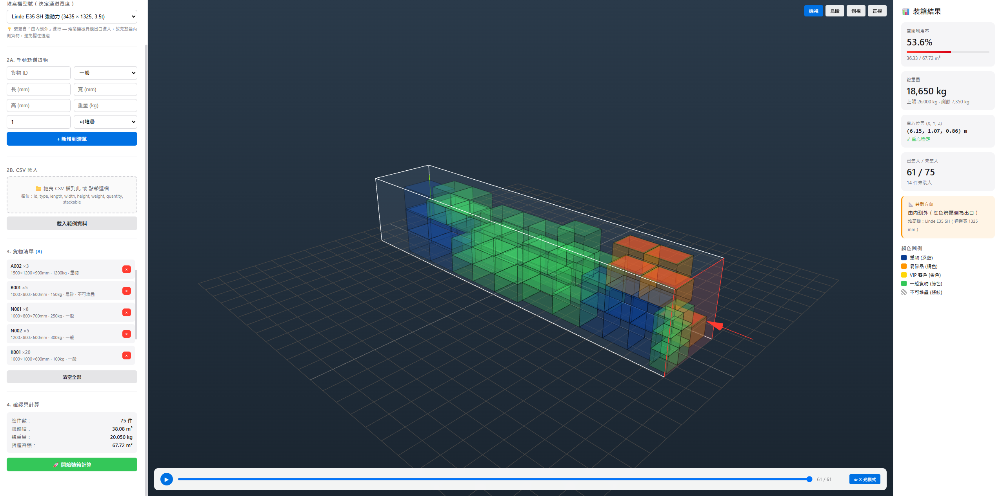
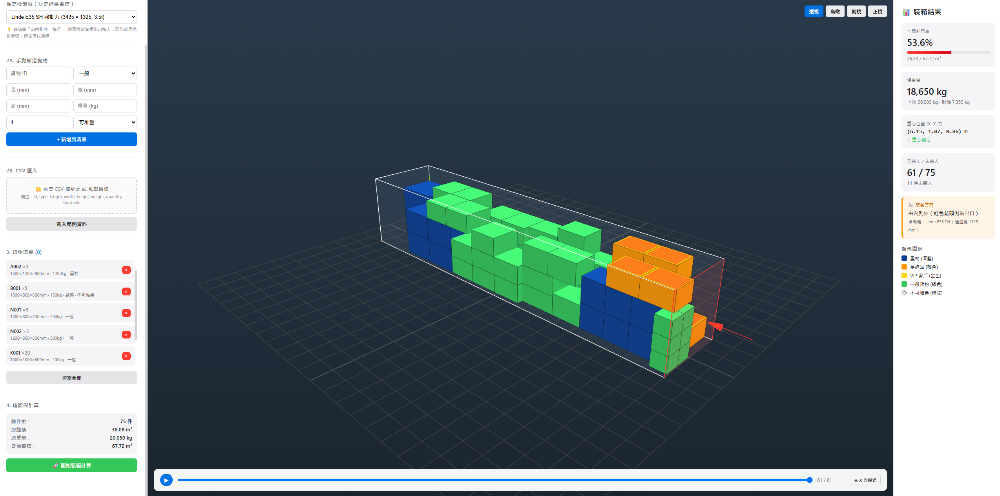
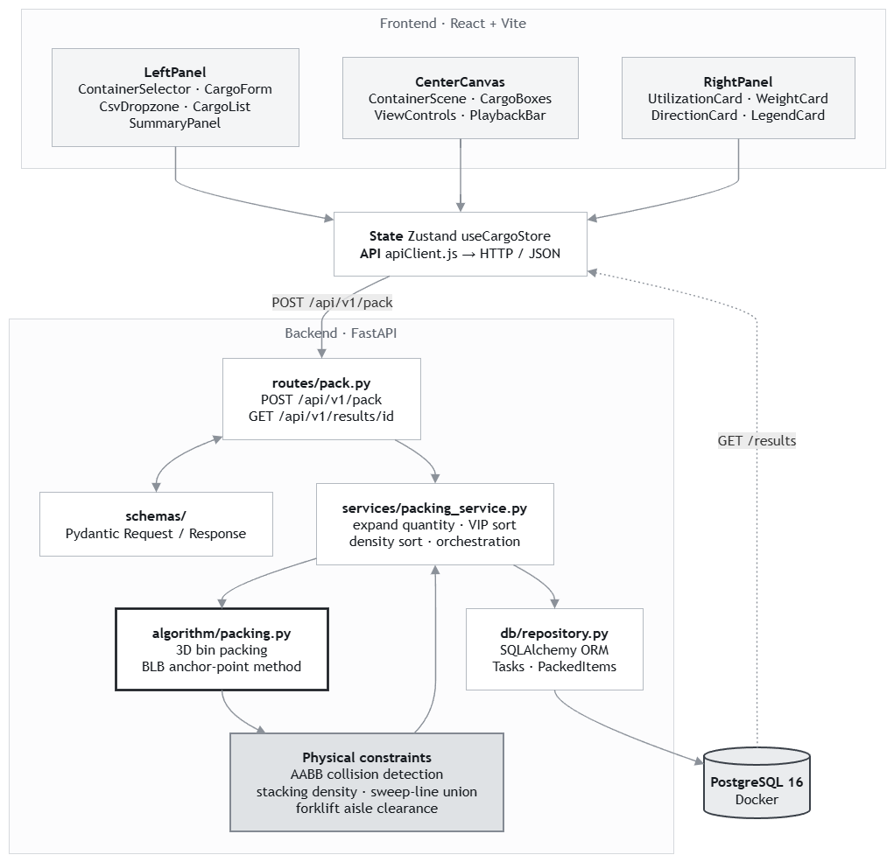

# 3D Container Packing System

*[中文版本](README.zh-TW.md)*

> 3D bin-packing with forklift aisle constraints, real-time visualization, and full-stack Docker deployment.

**Live Demo → [wutesta0101-hue.github.io/container-packing](https://wutesta0101-hue.github.io/container-packing)**



---

## What It Does

Upload cargo data — manual entry or CSV — and the system computes an optimal 3D loading plan for a shipping container, respecting the physical constraints most bin-packing demos ignore:

- **Forklift aisle clearance** — every item must be reachable by a forklift entering from the door. Enforced geometrically, not as a heuristic.
- **Stacking rules** — items stack only on stackable cargo, and only when the upper item's density is at most 105% of its support.
- **Support coverage** — at least 90% of an item's base must rest on something, computed as an exact area union rather than a corner check.
- **VIP priority** — designated high-value cargo is packed into the innermost positions first.
- **Inside-out loading order** — packing proceeds from the rear of the container toward the door, matching real forklift workflow.

Results render in interactive 3D with X-ray mode, step-by-step playback, and a utilization / centre-of-gravity dashboard.

| Solid view | X-ray view |
|---|---|
|  |  |

The playback bar replays the loading sequence one item at a time, so a warehouse team can see the intended order rather than just the final state.

---

## System Architecture



The frontend is a three-panel React app sharing a single Zustand store. All packing logic lives in `algorithm/packing.py` — pure functions with no framework dependencies, unit-testable in isolation. The four physical constraints are evaluated in sequence on every candidate position.

---

## Core Algorithm

The packing engine implements a 3D **Bottom-Left-Back (BLB) anchor-point** algorithm. Each item is placed at the first feasible anchor that passes four sequential physical constraints.

### Coordinate system

Origin $(0,0,0)$ is the rear-left-bottom corner. The door is at $x = L_{container}$.

```
z (height)
│
│    y (width)
│   ╱
│  ╱
│ ╱
└──────── x (depth, toward door)
```

### 1. Sorting strategy

Items are sorted by a three-key priority before packing begins:

$$\text{key}(i) = \big(\lnot\,\text{is\_vip}_i,\; -V_i,\; -m_i\big), \qquad V_i = L_i W_i H_i$$

VIP items always land deepest, matching real inside-out loading order.

### 2. Anchor-point generation

After placing item $k$ at $(x_k, y_k, z_k)$, three new candidate anchors appear:

$$A_{k+1} = \{(x_k + L_k,\, y_k,\, z_k),\ (x_k,\, y_k + W_k,\, z_k),\ (x_k,\, y_k,\, z_k + H_k)\}$$

Anchors are tried in lexicographic order $(x, z, y)$ — deepest first, then lowest, then leftmost — which produces dense, floor-hugging arrangements.

### 3. Constraint stack

Every candidate position must pass four checks, in order:

**① Boundary**

$$x + L_i \le L_c \ \land\ y + W_i \le W_c \ \land\ z + H_i \le H_c$$

**② Collision (AABB)**

For every placed item $p$, no axis-aligned bounding box overlap:

$$x + L_i \le p.x \ \lor\ p.x + p.L \le x \ \lor\ y + W_i \le p.y \ \lor\ \cdots$$

**③ Stacking support**

If $z > 0$, the item must rest on stackable supports satisfying both a density rule and a coverage rule:

$$\rho_{upper} \le \rho_{support} \times 1.05$$

$$\frac{\text{Area}\!\left(\bigcup_s \text{proj}(s) \cap \text{base}(i)\right)}{L_i \times W_i} \ \ge\ 0.9$$

The union area is computed exactly by a sweep-line algorithm in $O(N^2)$ — a corner-sampling approximation would accept overhangs that collapse in practice.

**④ Forklift aisle clearance**

The corridor between the candidate position and the door must be clear within the forklift's operating envelope. A fork-reach tolerance $r = 0.9 \times l_{fork}$ allows the forks to slide partially under the next item:

$$\forall\, p \in \text{placed}: \quad p.x \ge x + L_i + r \implies \lnot\big(Y_{overlap}(p) \land p.z < H_{forklift}\big)$$

where $Y_{overlap}$ tests whether $p$ falls within the aisle width $\max(W_i, W_{forklift})$ centred on the item's $y$ midpoint.

---

## Tech Stack

| Layer | Technology |
|---|---|
| Frontend | React 18 + Vite, Three.js, Zustand, Axios |
| 3D rendering | Three.js r128 (custom OrbitControls) |
| Backend | Python 3.11, FastAPI, Pydantic v2 |
| Database | PostgreSQL 16, SQLAlchemy ORM |
| Containerization | Docker + Docker Compose |
| Frontend serving | Nginx (production build) |

---

## Quick Start

**Prerequisites** — Docker Desktop (or Docker Engine + Compose plugin), Git.

```bash
git clone https://github.com/wutesta0101-hue/container-packing.git
cd container-packing

cp .env.docker.example .env.docker
# defaults work out of the box; edit only to change DB credentials

docker compose up -d
```

This starts four services:

| Service | URL | Purpose |
|---|---|---|
| Frontend | `http://localhost` | React app via Nginx |
| Backend | internal | FastAPI (port 9000) |
| PostgreSQL | internal | Database |
| pgAdmin | `http://localhost:8080` | DB management UI |

Verify:

```bash
docker compose ps            # all services "running"
docker compose logs backend  # should show "Uvicorn running"
```

Open `http://localhost` — the packing interface loads. Click **Load sample data** to try it without entering cargo manually.

Stop:

```bash
docker compose down          # stop, data preserved
docker compose down -v       # stop and wipe database
```

---

## API Reference

### `POST /api/v1/pack`

Submit cargo data and run the packing algorithm.

```json
{
  "container": "20ft",
  "forklift": "linde_e25",
  "cargo": [
    {
      "id": "A001",
      "type": "standard",
      "L": 1200,
      "W": 800,
      "H": 1000,
      "weight": 500,
      "quantity": 3,
      "stackable": true
    }
  ]
}
```

```json
{
  "task_id": "abc123",
  "packed": [
    { "id": "A001-1", "x": 0, "y": 0, "z": 0, "L": 1200, "W": 800, "H": 1000 }
  ],
  "unpacked": [],
  "utilization": 0.87,
  "cog": { "x": 4200, "y": 1150, "z": 620 }
}
```

### `GET /api/v1/results/{task_id}`

Retrieve a previously computed result.

---

## Reference Data

### Containers

| Code | Dimensions L × W × H (mm) |
|---|---|
| `20ft` | 5,900 × 2,350 × 2,390 |
| `40ft` | 12,030 × 2,350 × 2,390 |
| `40ft_hc` | 12,030 × 2,350 × 2,695 |

### Forklifts

Based on Linde E-series technical specifications. The selected model determines the required aisle width.

| Code | Aisle width (mm) | Body height (mm) |
|---|---|---|
| `linde_e25` | 1,100 | 2,150 |
| `linde_e30` | 1,150 | 2,150 |
| `linde_e35` | 1,200 | 2,200 |

### CSV import format

```csv
id,type,L,W,H,weight,quantity,stackable
A001,standard,1200,800,1000,500,3,true
B001,vip,800,600,800,200,1,false
```

| Column | Type | Description |
|---|---|---|
| `id` | string | Unique cargo identifier |
| `type` | `standard` / `vip` | VIP items are packed first, innermost |
| `L`, `W`, `H` | integer (mm) | Dimensions |
| `weight` | float (kg) | Used for the stacking density check |
| `quantity` | integer | Number of identical units |
| `stackable` | boolean | Whether other items may rest on top |

---

## Project Structure

```
container-packing/
├── backend/
│   ├── algorithm/
│   │   └── packing.py           ← 3D BPP core, pure functions, unit-testable
│   ├── db/
│   │   └── repository.py        ← SQLAlchemy ORM, Tasks + PackedItems
│   ├── routes/
│   │   └── pack.py              ← FastAPI route handlers
│   ├── schemas/                 ← Pydantic request / response models
│   ├── services/
│   │   └── packing_service.py   ← Business logic, orchestration
│   ├── core/
│   │   └── config.py            ← .env, CORS settings
│   ├── tests/                   ← Unit tests for the algorithm
│   ├── main.py
│   ├── Dockerfile
│   └── requirements.txt
├── frontend/
│   ├── src/
│   │   ├── components/
│   │   │   ├── LeftPanel/       ← Input forms, CSV upload, cargo list
│   │   │   ├── CenterCanvas/    ← Three.js 3D scene
│   │   │   └── RightPanel/      ← Dashboard cards
│   │   ├── store/
│   │   │   └── useCargoStore.js ← Zustand global state
│   │   └── api/
│   │       └── apiClient.js     ← Axios, all backend calls
│   ├── Dockerfile
│   └── nginx.conf
├── docs/
├── docker-compose.yml
├── docker-compose.override.yml  ← Dev overrides: exposed ports, hot reload
└── .env.docker.example
```

---

## Related

**[Container Arrival Tracker](https://github.com/wutesta0101-hue/container-arrival-tracker)** — zero-infrastructure arrival tracking for warehouse, customs, and procurement teams.

**[EMR Picking Sequence Optimizer](https://github.com/wutesta0101-hue/emr-scheduling)** — the scheduling counterpart: this project decides *where cargo goes*, that one decides *what order to reach it in*. Same forklift, same accessibility constraint.

---

**License** — MIT
